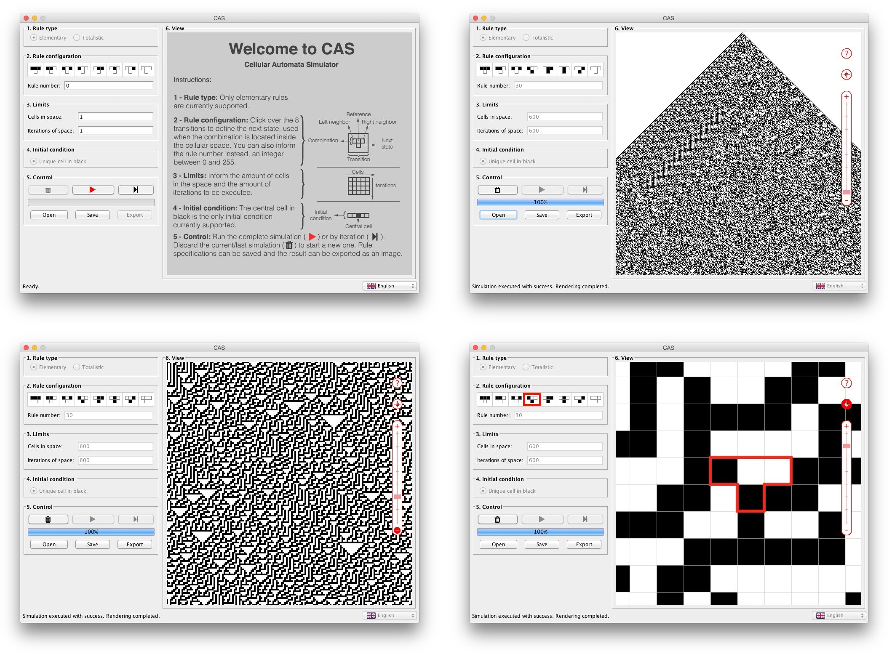
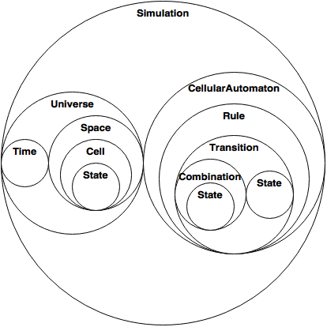
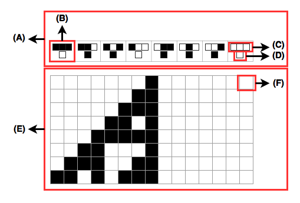
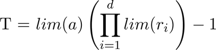
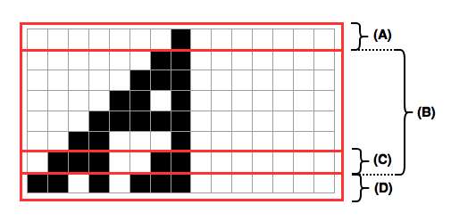
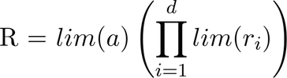

#CAS - Cellular Automata Simulator
The Cellular Automata Simulator (CAS) is a project of didactic and scientific purpose, based on the publications of Stephen Wolfram and other great autors like Andrew Ilachinski, Harold V. McIntosh, Joel L. Schiff; also inspired by the ideas of Stanislaw Ulam and John von Neumann. See the full reference on page 65 of [the monograph](http://dsc.inf.furb.br/arquivos/tccs/monografias/2016_2_guilherme-humberto-jansen_monografia.pdf).

The goal of this project is to assist the study of cellular automata by providing a simple platform that allows a practical experience of the theoretical concepts. Hopefully, after becoming comforatable with these concepts, one may feel inspired to explore more complex ones.

##Download
Download the [latest release here](http://www). You can also see [all realeases here](https://github.com/ghjansen/cas/releases).

Before using CAS, please consider reading [this page](http://mathworld.wolfram.com/ElementaryCellularAutomaton.html) from [Wolfram Research](http://www.wolfram.com) to ensure a good notion about elementary cellular automaton. If you know brazilian portuguese you can also read the [full monograph about CAS here](http://dsc.inf.furb.br/arquivos/tccs/monografias/2016_2_guilherme-humberto-jansen_monografia.pdf).

CAS is distributed under the [GNU Affero General Public Licence v3.0 (AGPLv3)](http://www.gnu.org/licenses/agpl-3.0.txt) and is compatible with Mac, Linux and Windows.

##Structure
CAS is currently organized in 5 modules: [`cas-core`](/cas-core), [`cas-control`](/cas-control), [`cas-unidimensional`](/cas-unidimensional), [`cas-ui-desktop`](/cas-ui-desktop) and [`cas-docs`](/cas-docs). The table below shows a quick description of each one of the modules:

Module name | Description
------------|------------
[`cas-core`](/cas-core) | Abstract structures that represent the common characteristics of most cellular automata, independent of the amount of dimensions.
[`cas-control`](/cas-control) | Abstract resources for controlling the simulation lifecycle.
[`cas-unidimensional`](/cas-unidimensional) | One-dimensional implementation of the [`cas-core`](/cas-core) and [`cas-control`](/cas-control) modules, responsible for defining specific characteristics and for controlling the simulation of one-dimensional cellular automata.
[`cas-docs`](/cas-docs) | Documentation.

##Core overview
Originally conceived to simulate [elementary cellular automaton](http://mathworld.wolfram.com/ElementaryCellularAutomaton.html), CAS was designed to allow the implementation of most kinds of cellular automata, independent of the amount of cells, dimensions, iterations, rules, etc.

The data model located inside [`cas-core`](/cas-core) abstracts common characteristics of  cellular automata, forming a fundamental structure required to simulate any cellular automaton. The set diagram below shows the composition between the elements of the data model, suppressing the notion of cardinality.

For a better understanding of the data model, the image below highlights some of the elements through a [elementary cellular automaton](http://mathworld.wolfram.com/ElementaryCellularAutomaton.html) by using the representation commonly found in the literature. In image below you can see [`Rule`](cas-core/src/main/java/com/ghjansen/cas/core/ca/Rule.java) (A), [`Transition`](cas-core/src/main/java/com/ghjansen/cas/core/ca/Transition.java) (B), [`Combination`](cas-core/src/main/java/com/ghjansen/cas/core/ca/Combination.java) (C), [`State`](cas-core/src/main/java/com/ghjansen/cas/core/ca/State.java) (D), [`Space`](cas-core/src/main/java/com/ghjansen/cas/core/physics/Space.java) (E) and [`Cell`](cas-core/src/main/java/com/ghjansen/cas/core/physics/Cell.java) (F).

From all elements of the data model, [`Time`](cas-core/src/main/java/com/ghjansen/cas/core/physics/Time.java), [`Space`](cas-core/src/main/java/com/ghjansen/cas/core/physics/Space.java) and [`CellularAutomaton`](cas-core/src/main/java/com/ghjansen/cas/core/ca/CellularAutomaton.java) can be considered as the most important ones. More information about each one of these elements is detailed below.

###Time
[`Time`](cas-core/src/main/java/com/ghjansen/cas/core/physics/Time.java) and [`Space`](cas-core/src/main/java/com/ghjansen/cas/core/physics/Space.java) are two concepts closely related by the dimensional aspect, that is, the number of dimensions used by the cellular automaton affects not only the cellular space but also the time. This feature is oriented to the sequential nature of the simulator, which updates the [`Space`](cas-core/src/main/java/com/ghjansen/cas/core/physics/Space.java) and [`Time`](cas-core/src/main/java/com/ghjansen/cas/core/physics/Time.java) in an atomic operation consecutively until it reaches the parametrized limits for the simulation.

To allow [`Time`](cas-core/src/main/java/com/ghjansen/cas/core/physics/Time.java) to operate in a dimensional way, two approaches were created: absolute time and relative time. The absolute time is responsible for maintaining the amount of [`Space`](cas-core/src/main/java/com/ghjansen/cas/core/physics/Space.java) iterations already processed by the [`CellularAutomaton`](cas-core/src/main/java/com/ghjansen/cas/core/ca/CellularAutomaton.java) and can be represented by an integer. The relative time informs the next [`Cell`](cas-core/src/main/java/com/ghjansen/cas/core/physics/Cell.java) to be processed within the current iteration and is represented by a list of integers, where the number of elements in the list is equal to the number of dimensions of the [`CellularAutomaton`](cas-core/src/main/java/com/ghjansen/cas/core/ca/CellularAutomaton.java).

Thus, it is correct to state that the [`Time`](cas-core/src/main/java/com/ghjansen/cas/core/physics/Time.java) class is a dynamic counter incremented from its lower limit (zero) acting on each of the dimensions (relative time) until it completely processes a [`Space`](cas-core/src/main/java/com/ghjansen/cas/core/physics/Space.java) iteration (absolute time), repeating this cycle until it reaches the limits of [`Time`](cas-core/src/main/java/com/ghjansen/cas/core/physics/Time.java).

[`Time`](cas-core/src/main/java/com/ghjansen/cas/core/physics/Time.java) increases its counters during a simulation in a mathematical ratio equivalent to the product of the limits of the relative counters multiplied by the limit of the absolute counter, minus one. This formula is shown in the image below, where `a` represents the absolute counter,`d` represents the amount of relative counters (or amount of dimensions), `ri` represents a relative counter `i` and `lim` is the function that obtains the limit of each counter.

###Space
The [`Space`](cas-core/src/main/java/com/ghjansen/cas/core/physics/Space.java) class is a dynamic array responsible for keeping all [`Cell`](cas-core/src/main/java/com/ghjansen/cas/core/physics/Cell.java)s from the initial condition defined for the simulation (`initial` attribute), the history of the iterations already processed (`history` attribute), the last iteration processed (`last` attribute) and the iteration that is being processed (`current` attribute). The `initial`, `last` and `current` attributes are lists of generic type in order to allow multidimensional structures, whereas the `history` attribute is a list of lists, since `history` stores copies of `current`. The image below shows a representation of the attributes `initial` (A),`history` (B), `last` (C) and `current` (D) through the computation of elementary rule 110.

###CellularAutomaton
The [`CellularAutomaton`](cas-core/src/main/java/com/ghjansen/cas/core/ca/CellularAutomaton.java) class is the conceptual representation of the cellular automaton used in the simulation. The logic of this class uses other important classes like [`Rule`](cas-core/src/main/java/com/ghjansen/cas/core/ca/Rule.java), [`Transition`](cas-core/src/main/java/com/ghjansen/cas/core/ca/Transition.java), [`Combination`](cas-core/src/main/java/com/ghjansen/cas/core/ca/Combination.java) and [`State`](cas-core/src/main/java/com/ghjansen/cas/core/ca/State.java). The algorithm executed by the [`CellularAutomaton`](cas-core/src/main/java/com/ghjansen/cas/core/ca/CellularAutomaton.java) is:
- **1**. Get the [`Combination`](cas-core/src/main/java/com/ghjansen/cas/core/ca/Combination.java) from the [`Space`](cas-core/src/main/java/com/ghjansen/cas/core/physics/Space.java) for the current [`Time`](cas-core/src/main/java/com/ghjansen/cas/core/physics/Time.java);
- **2**. Obtain the [`Transition`](cas-core/src/main/java/com/ghjansen/cas/core/ca/Transition.java) from the [`Rule`](cas-core/src/main/java/com/ghjansen/cas/core/ca/Rule.java), corresponding to the [`Combination`](cas-core/src/main/java/com/ghjansen/cas/core/ca/Combination.java) identified in step **1**;
- **3**. Inform the [`State`](cas-core/src/main/java/com/ghjansen/cas/core/ca/State.java) of the new [`Cell`](cas-core/src/main/java/com/ghjansen/cas/core/physics/Cell.java) to the [`Space`](cas-core/src/main/java/com/ghjansen/cas/core/physics/Space.java), based on the current [`Time`](cas-core/src/main/java/com/ghjansen/cas/core/physics/Time.java) and the [`Transition`](cas-core/src/main/java/com/ghjansen/cas/core/ca/Transition.java) identified in step **2**;
- **4**. Increase [`Time`](cas-core/src/main/java/com/ghjansen/cas/core/physics/Time.java).

The amount of times that the algorithm of the [`CellularAutomaton`](cas-core/src/main/java/com/ghjansen/cas/core/ca/CellularAutomaton.java) is executed can be represented by a mathematical ratio similar to [`Time`](cas-core/src/main/java/com/ghjansen/cas/core/physics/Time.java) increasement formula, except that for the [`CellularAutomaton`](cas-core/src/main/java/com/ghjansen/cas/core/ca/CellularAutomaton.java) algorithm execution formula there is no subtraction of 1, as shown by the image below.

##Contribute
There is a lot to be improved and created. Check [the list of issues](https://github.com/ghjansen/cas/issues) and [all the projects](https://github.com/ghjansen/cas/projects) to see what's happening, maybe including your suggestions or bugs found. If you feel inspired by one of the issues/projects or by CAS itself, feel free to make contact through .

